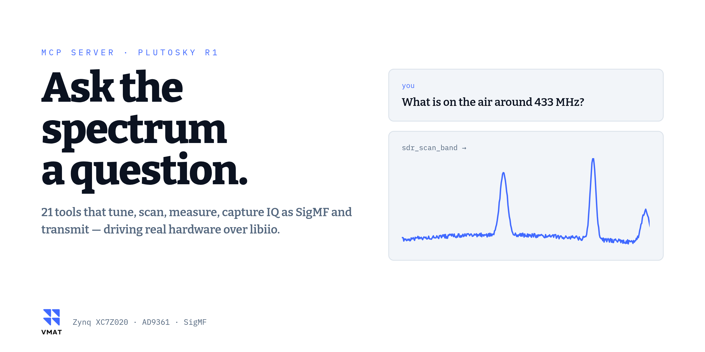

<p align="center">
  <picture>
    <source media="(prefers-color-scheme: dark)" srcset="docs/img/covers/mcp-prompt-dark.png">
    
  </picture>
</p>

# fishball-sdr-mcp

<p align="center">
  
  
  
  
  <a href="LICENSE"></a>
</p>

> **Sibling repository.** This server drives the radio. Its sibling,
> [**fishball7020-fpga-devkit**](https://github.com/matsvandamme/fishball7020-fpga-devkit),
> builds the firmware that runs on it — HDL, kernel, bootloader, and a
> [54-lesson course](https://matsvandamme.github.io/fishball7020-fpga-devkit/course/)
> on how the whole thing works. Use them together: the devkit changes what the
> board *is*, this server changes what it is *doing*.

Ask an LLM what's on the air, and have it actually go and look.

An [MCP](https://modelcontextprotocol.io) server for the **Fishball7020 /
PlutoSky** software-defined radio (Zynq-7020 + AD9361). It turns the board into
21 tools an assistant can use: tune it, sweep a band, measure a spectrum,
capture IQ, engage the FPGA channel filter, and transmit.

<sub>**New to any of that?** A *software-defined radio* is a receiver and
transmitter whose behaviour is decided in software rather than by fixed
circuitry — you tell it a frequency and it tunes there. *MCP* is a standard way
of exposing a set of actions to an AI assistant, so it can operate something
directly rather than describe how you might. *IQ* is the raw form radio samples
take: two numbers per sample, which together carry both the strength and the
timing of the wave. Put together: this lets an assistant use the radio.</sub>

```
> what FM stations can I actually receive here?

  sdr_scan_band(start_hz=87500000, stop_hz=108000000)

  | Frequency  | Level      | Above floor |
  |------------|------------|-------------|
  | 102.1 MHz  | -31.5 dBFS | 73.9 dB     |
  | 100.7 MHz  | -44.2 dBFS | 61.2 dB     |
  ...
```

The board's firmware and FPGA build system live in a companion repository,
[fishball7020-fpga-devkit](https://github.com/matsvandamme/fishball7020-fpga-devkit).

---

## I want to…

| I want to… | Start here |
|---|---|
| get it running with Claude Desktop or Claude Code | [Quick start](#quick-start) |
| see every tool and what it does | [Tools](#tools) |
| point it at a board on a different address | [Configuration](#configuration) — `SDR_MCP_URI` |
| transmit, safely | [Transmitting](#transmitting) — read this one before keying anything |
| know why a transmit was refused, and how to go ahead anyway | [The safety gate](#the-safety-gate-bands-power-and-overrides) — `override_reason`, `force` |
| work out what my RF ports are connected to | `sdr_check_rf_setup`, and [Before you transmit](#before-you-transmit-what-is-connected) |
| turn transmitting off entirely | [Turning transmit off](#turning-transmit-off) — `SDR_MCP_ALLOW_TX=0` |
| understand why a capture is int16 and what full scale is | [Three design decisions](#three-design-decisions-worth-knowing) |
| run the tests | [Testing](#testing) |
| know what this board actually measures like | [Notes from the hardware](#notes-from-the-hardware) |
| decode aircraft (ADS-B, 1090 MHz) | the devkit's [`./devkit adsb`](https://github.com/matsvandamme/fishball7020-fpga-devkit/blob/main/docs/adsb.md): a live window, receive only. There is no ADS-B tool here, but a capture from here decodes there: `sdr_configure_rx` to 1090 MHz at 4 MSPS with the FPGA filter off, `sdr_capture_iq`, then `./devkit adsb --replay <file>.sigmf-meta --text` |
| script a repeatable bench measurement (set, transmit, capture, fetch) from Python | the devkit's [automation server](https://github.com/matsvandamme/fishball7020-fpga-devkit/blob/main/docs/automation.md): gRPC on the board, port 7020, with the transmit rules enforced on the board; a [complete example](https://github.com/matsvandamme/fishball7020-fpga-devkit/blob/main/docs/radio/sweep-a-loopback.md) sweeps both loopbacks to a CSV, and a [receive beamformer](https://github.com/matsvandamme/fishball7020-fpga-devkit/blob/main/docs/radio/beamform-two-boards.md) uses several boards on one reference clock as one antenna array. It and this server share one radio: while either holds a buffer, the other is refused |
| drive this board from MATLAB or Simulink instead | the devkit's [MATLAB guide](https://github.com/matsvandamme/fishball7020-fpga-devkit/blob/main/docs/matlab.md) and its [Simulink blocks](https://github.com/matsvandamme/fishball7020-fpga-devkit/tree/main/examples/matlab/06-simulink) |
| change the firmware itself, not just drive it | the sibling [fishball7020-fpga-devkit](https://github.com/matsvandamme/fishball7020-fpga-devkit) |

## Quick start

```bash
# run from: wherever you want the server to live (e.g. ~)
git clone https://github.com/matsvandamme/Fishball7020-mcp.git
cd Fishball7020-mcp
python3 -m venv .venv
.venv/bin/pip install -e .

claude mcp add fishball-sdr -- "$PWD/.venv/bin/fishball-sdr-mcp"
```

`-e .` installs the package into the venv, which puts a `fishball-sdr-mcp`
launcher on the venv's `bin/`. Use that rather than `python -m
fishball_sdr_mcp`: your MCP client starts the server from its own working
directory, not this one, so a bare `-m` invocation will not find the package.

Note the venv records absolute paths. If you move this directory, delete
`.venv` and recreate it.

Then ask for `sdr_get_status`. If the board answers, you're done.

Not sure where your board is? `iio_attr -S` scans and prints it. The default is
`ip:fishball.local`, the name the board announces on whichever link it is on:
USB, your router, or a cable straight to your PC.

## Working on this server

`.claude/skills/fishball-sdr-mcp/` is an [Agent Skill](https://agentskills.io/specification):
if you use Claude Code it loads automatically here, carrying the server's own
conventions and the hardware facts that keep catching people out — the power
amplifier and what it means for a loopback, 12-bit receive against 16-bit
transmit, why `hardwaregain` is an index rather than a gain, the IIOD protocol
gotchas, and that stdout belongs to JSON-RPC. Harmless if you don't use an agent.

## Requirements

Python 3.10+, and a Fishball7020 reachable over libiio. That's it.

The board is reached over libiio's **network protocol using plain sockets**, so
there is no `pylibiio` to install and no libiio version to match against your
firmware. `numpy` is used for the FFT if it happens to be importable, and a
pure-Python transform otherwise — the server runs with only `mcp` installed.

## Tools

**Look at things** — `sdr_get_status` · `sdr_spectrum` · `sdr_scan_band` ·
`sdr_capture_iq` · `sdr_board_health` · `sdr_list_devices` ·
`sdr_read_attribute` · `sdr_find_board`

**Change things** — `sdr_tune` · `sdr_configure_rx` · `sdr_set_fpga_filter` ·
`sdr_sample_gpio` · `sdr_sample_gpio_clock`

**Transmit** (enabled; set `SDR_MCP_ALLOW_TX=0` to forbid) — `sdr_tx_tone` · `sdr_transmit_iq` ·
`sdr_transmit_waveform` · `sdr_sample_gpio_clock` · `sdr_check_rf_setup` (its
loopback probe transmits at −41 dBm on the receive LO; passive when the gate is
closed) · `sdr_tx_status` · `sdr_tx_chain_state` · `sdr_tx_disable`

> What this board's transmitter actually produces — ten modulations sent from a
> Fishball7020 and received on a **HackRF One**, with spectra, constellations,
> EVM and spur attribution — is measured in the devkit's
> [modulation gallery](https://github.com/matsvandamme/fishball7020-fpga-devkit/blob/main/docs/modulation-gallery.md),
> along with the code to repeat it.

**Ask the bib reader** — `sdr_rfid_field` reports what the EPC Gen2 reader
has in front of its antenna: which chips are answering, how often, how
strongly, their factory serial numbers, and what the reader makes of the
field. It asks the reader's own web server rather than the radio, because
the reader owns the board while it runs and two things driving one board is
how you get a reader that stops reading. Start it first, from the
[Fishball7020-ucode8-reader](https://github.com/matsvandamme/Fishball7020-ucode8-reader)
repository:

```bash
# run from: that repository's root
.venv/bin/python host/gui.py --read tid
```

Every tool takes `response_format`: `markdown` to read, `json` to parse.

### Three design decisions worth knowing

**`sdr_capture_iq` writes a SigMF pair and returns both paths.** It never
returns samples inline — even a short capture is megabytes, and putting that
through a context window helps nobody. The samples go to `<name>.sigmf-data` as
interleaved little-endian `int16`, which GNU Radio reads as a file source of
type *short* and which `sdr_transmit_iq` accepts straight back.

Beside it goes `<name>.sigmf-meta`, because a capture returned through MCP
outlives the conversation that produced it and whoever opens it next cannot
scroll back to find the sample rate. The sidecar carries rate, centre frequency,
gain, AGC mode, RSSI, bandwidth and the capture statistics — every one **read
back off the board** after configuration rather than echoed from the request,
since gain quantises to the AD9361's own table and `rf_bandwidth` snaps to what
the filter design supports.

It also records the one thing SigMF has no field for: receive full scale on this
board is **±2047**, not ±32767, because the converters are 12-bit sign-extended
into an int16. Divide by 32768 and every absolute level is 24 dB low — uniformly,
so nothing looks wrong.

**`sdr_set_fpga_filter` works by setting a sample rate.** There is no "filter
on" attribute anywhere. Writing `cf-ad9361-lpc`'s `sampling_frequency` to one
eighth of the converter rate is precisely what drives `GP_CONTROL` bit 0 and
flips the bypass mux in the bitstream. See
[the channelizer write-up](https://github.com/matsvandamme/fishball7020-fpga-devkit/blob/main/docs/wbfm-channelizer.md).

**`sdr_sample_gpio` exposes a feature of the devkit firmware, not of the chip.**
The AD9361's transmit DAC is 12 bits and reads only the top 12 of each 16-bit
sample, so the bottom four are discarded. Devkit firmware routes them to four
expansion-header pins instead, making digital outputs whose edges are locked to
the RF sample that carried them — a clock, a frame marker, a sync line. The
tool turns that routing on and off; *what* the pins do is whatever pattern you
put in the low nibble of the samples you transmit, OR-ed in last so nothing
rescales it away. `sdr_sample_gpio_clock` writes such a pattern for you — a
square wave, and optionally a one-sample frame marker — and refuses a buffer
length that is not a whole number of cycles, because that produces a clock
which stutters once per buffer wrap. Firmware without patches 0006/0007 has no such attribute and
the tool says so rather than failing obscurely. See
[the feature reference](https://github.com/matsvandamme/fishball7020-fpga-devkit/blob/main/docs/tx-gpio-bitmap.md).

**Receive levels are dBFS against a 12-bit converter**, so full scale is ±2047.
Transmit is *not*: the DAC takes the full 16-bit range. That asymmetry is
measured, not assumed — see [Notes from the hardware](#notes-from-the-hardware).

## Configuration

| Variable | Default | Meaning |
|---|---|---|
| `SDR_MCP_URI` | `ip:fishball.local` | Where the board is. A name, not an address, so it survives DHCP moving the board |
| `SDR_MCP_TIMEOUT` | `10` | Socket timeout, seconds |

**If your board is not on `192.168.2.1`.** That address is the USB Ethernet
gadget. A board plugged into a router has a second, different address on `eth0`,
and you do not have to know it — the board advertises itself over mDNS, so
`ip:fishball.local` works as a URI and keeps working when the address
changes. (`fishball` is the devkit's default hostname; a board on an
unpatched rootfs still answers to `pluto.local`.)

**A board cabled straight to your PC** has no router to give it an address:
let the PC serve DHCP (NetworkManager's shared mode), as in the devkit's
[a direct cable to your PC](https://github.com/matsvandamme/fishball7020-fpga-devkit/blob/main/docs/networking.md#a-direct-cable-to-your-pc).
`ip:fishball.local` then finds it there, and `sdr_find_board` checks this
machine's neighbour table as well. The cable is not much faster: the board's
CPU, not gigabit, limits streaming, to 12 MS/s at 16 bits through `iiod`
([measured](https://github.com/matsvandamme/fishball7020-fpga-devkit/blob/main/docs/streaming-paths.md#on-a-direct-cable)).

```bash
# run from: your HOST
iio_info -s                                  # what is out there, with addresses
export SDR_MCP_URI=ip:fishball.local     # or ip:192.168.1.50
```

Changing the board's own address is a devkit matter rather than an MCP one:
[changing the board's IP address](https://github.com/matsvandamme/fishball7020-fpga-devkit/blob/main/docs/networking.md)
covers the four routes, including why editing `uEnv.txt` on the SD card looks
like it works and does not.
| `SDR_MCP_CAPTURE_DIR` | `~/.cache/fishball-sdr` | Where `sdr_capture_iq` writes its `.sigmf-data` / `.sigmf-meta` pair |
| `SDR_MCP_ALLOW_TX` | unset (**permitted**) | Set to `0` to forbid transmitting |
| `SDR_MCP_TX_BANDS` | unset | Restrict TX, e.g. `2400-2483.5` (MHz) |
| `TYPESAFE_API_KEY` | unset | Have [TypeSafe](https://typesafe.ai) check the reason given for overriding the [safety gate](#the-safety-gate-bands-power-and-overrides) |
| `SDR_MCP_NO_TX_QUIESCE` | unset | Leave the transmitter exactly as found |

`.mcp.json.example` is a drop-in config if you'd rather not use `claude mcp add`.

## Transmitting

**Transmitting is enabled.** It used to be off unless you opted in; the board's
owner asked for it available without ceremony, so the switch is now the other
way round — set `SDR_MCP_ALLOW_TX=0` to turn it off.

That puts the responsibility on you rather than on a flag. This board reaches
about **+19 dBm** (roughly 80 milliwatts) and tunes the FM broadcast band, where
transmitting without a licence is illegal in most countries. Two consequences
worth internalising before the first call:

- **Into an antenna**, you are a transmitter, and the law applies.
- **Into a cable**, you can destroy the board — see the warning below.

### Before you transmit: what is connected?

```
sdr_check_rf_setup
```

Run this whenever you are about to transmit and do not already know how the
board is cabled. It reports what the ports appear to be attached to.

**It is honest about a real limit.** This board has no detector on the transmit
socket, so whether an antenna is attached *there* cannot be measured — not by
this tool, not by anything. What it can do it does: it listens on the receive
port for ambient radio (a sign an antenna is attached to *that*), and sends a
deliberately tiny probe to see whether a cable carries it back. Measured, the
two cases are unambiguous: about 4–7 dB of return with no cable, about 70 dB
through a 20 dB attenuator.

The probe transmits at −41 dBm, roughly a ten-thousandth of a milliwatt — far
too little to matter off an antenna, and 44 dB below what the receiver can
survive. `probe=false` keeps it entirely passive.

### Choosing a channel

The board has two independent transmit chains, TX1 and TX2. `sdr_tx_tone`,
`sdr_transmit_iq` and `sdr_transmit_waveform` all take `channel`:

| `channel` | Transmits from |
|---|---|
| `"0"` | TX1 |
| `"1"` | TX2 |
| `"both"` | both ports, the same waveform on each |

**There is no default** (since 2026-09-30; it used to be `"both"`): a transmit call
must name the port it keys, and one that does not is refused before the radio is
touched. A default drives a port nobody named — the same defect the devkit's
`tone.py` had, fixed the same way.

### The safety gate: bands, power, and overrides

Before `sdr_tx_tone`, `sdr_transmit_iq` or `sdr_transmit_waveform` touches the
radio, the server checks two things in code:

- **Band.** Everything the transmit emits must sit inside one of the EU
  licence-free bands: 433.05–434.79 MHz, 863–870 MHz, 2400–2483.5 MHz or
  5725–5875 MHz. "Everything" includes the leakage at the local oscillator (LO,
  the carrier frequency the chip is tuned to), the chirp's sweep, and, for an IQ
  file, the whole width its sample rate allows, because the server cannot see
  what is in the file.
- **Power.** The estimated output must stay under that band's legal limit:
  +10 dBm at 433 MHz, +14 dBm at 868 MHz and 5.8 GHz, +20 dBm at 2.4 GHz. The
  estimate is +19 dBm at full output, less the attenuation and the amplitude
  (`scale`). It is not a measurement, and an antenna's gain is not in it.

A transmit that fails either check is **refused**, with the reason. You then
have two ways on:

| Argument | What happens |
|---|---|
| `override_reason="TX1 cabled through 30 dB into RX1, no antenna"` | Transmits, and logs the reason. If `TYPESAFE_API_KEY` is set, [TypeSafe](https://typesafe.ai) reads the reason first and the transmit only goes ahead if it describes a safe setup: cabled into a load or attenuator with nothing radiated, inside a shielded box, or covered by a licence **for this frequency**. "Just testing" does not pass; neither does "I have an amateur licence" at 100 MHz. If TypeSafe cannot be reached, the override is refused. |
| `force=true` | Transmits anyway, with or without a reason, whatever the gate or TypeSafe said. The reply opens with a **WARNING** naming what was overruled, and the log records it as forced. The gate advises; you decide. |

TypeSafe is only asked about overrides, so a transmit inside the rules never
waits on the network. Without a key, `override_reason` is taken at its word and
logged as unchecked. The key goes in the server's environment, like every
variable here (see below), and is read on every override, so it never needs to
be in a prompt.

What it looks like, with a key set, asking for a tone at 100 MHz (the FM
broadcast band) with the reason "just testing, it's fine":

```text
ERROR: Refusing to transmit a tone: 100.0000-100.1000 MHz is not wholly inside a
licence-free band (...). TypeSafe (jev-1.13.0) read the override reason as not
describing a safe setup (conducted 0.03, shielded 0.01, licensed 0.02,
radiates 0.43). ...
```

Each number is TypeSafe's probability that the reason says so: that the port is
cabled with nothing radiated, that it is shielded, that a licence covers this
frequency, and that it goes out of an antenna. It accepts at 0.8 or above for one
of the first three, with "radiates" under 0.5 unless the licence covers it.
Those thresholds are chosen, not tuned.

The gate does not cover `sdr_check_rf_setup`'s −41 dBm probe or
`sdr_sample_gpio_clock`. `SDR_MCP_TX_BANDS`, if set, still applies on top, and
`force` does not lift it.

### Turning transmit off

The variable is read from the **server's** environment at startup, not from the
shell you type in, so exporting it in your terminal does nothing. Put it in the
MCP registration:

```bash
# run from: anywhere - the path below is absolute
claude mcp add fishball-sdr -e SDR_MCP_ALLOW_TX=0 -- \
    /absolute/path/to/Fishball7020-mcp/.venv/bin/fishball-sdr-mcp
```

or in `.mcp.json`:

```json
{ "mcpServers": { "fishball-sdr": {
    "command": "/absolute/path/to/Fishball7020-mcp/.venv/bin/fishball-sdr-mcp",
    "env": { "SDR_MCP_ALLOW_TX": "0" } } } }
```

**Restart your MCP client afterwards** — the environment is fixed when the
server process starts, so editing the registration mid-session changes nothing
until the client restarts. `sdr_tx_status` reports what the running server
actually believes.

- `sdr_tx_disable` and `sdr_tx_status` are **never** gated. An off switch that
  can be unavailable is not an off switch.
- `sdr_tx_disable` also runs on server shutdown, so a crashed client cannot
  leave the board transmitting a cyclic buffer.
- `cyclic=true` keeps transmitting **after the call returns**. That's the point
  of it, and it still surprises people; `sdr_tx_status` shows what's running.
- `SDR_MCP_TX_BANDS` restricts transmission to named frequency ranges, e.g.
  `2400-2483.5` (MHz), on top of everything above, including
  [the safety gate](#the-safety-gate-bands-power-and-overrides) and `force`.
- Every transmit call - tones, buffers, the RF-setup probe and the GPIO clock - is logged to stderr with frequency, gain, channel and sample count, and every safety-gate decision with its reason (`TX GATE pass`, `refused`, `override ACCEPTED`/`REJECTED`, `FORCED`).

> **A TX→RX loopback without an attenuator will destroy your receiver.** The
> receiver is the fragile end: the AD9361's RX input is rated to roughly
> **+2.5 dBm**. And this board is sold in a variant carrying a Mini-Circuits
> **PGA-102+** power amplifier — 17.7 dB of gain at 50 MHz falling to 10.4 dB
> at 6 GHz, P1dB +17.5 dBm. Plan for about **+19 dBm** flat out, some 16 dB
> above what its own receive port survives. That is an estimate, scaled up from
> a quieter measurement and capped at the amplifier's compression point, not a
> power-meter reading. Fit **at least 20 dB**. More is just as safe, but 20 dB
> also measures best: the board leaks some transmit signal straight into its
> own receiver, and through 50 dB that leak is as strong as the loop above about
> 1.5 GHz ([measured](https://github.com/matsvandamme/fishball7020-fpga-devkit/blob/main/docs/measured-performance.md#the-boards-own-tx-to-rx-leak)).
> Connect with TX attenuation at maximum and raise power in steps.

## Testing

```bash
# run from: the repo root
.venv/bin/python evaluation/smoke_test.py          # protocol only, no radio
.venv/bin/python evaluation/smoke_test.py --live   # also call read-only tools
```

This stands in for MCP Inspector, which needs Node 18 while Ubuntu 22.04
packages Node 12. It speaks JSON-RPC over stdio using only the standard library
and checks the handshake, tool schemas and annotations, that the transmit gate
refuses and names its variable, that diagnostics stay off stdout, and — with
`--live` — that every read-only tool returns real data. It never transmits and
never retunes your radio.

`evaluation/questions.xml` holds ten evaluation questions with verified answers,
per the [mcp-builder](https://github.com/anthropics/skills/tree/main/skills/mcp-builder)
skill this server was built to.

## Notes from the hardware

Things that cost real time to work out, recorded so they cost you none.

<sub>Two units appear repeatedly. **dBm** is absolute power: 0 dBm is one
milliwatt, +19 dBm about 80 mW, −41 dBm a ten-thousandth of a milliwatt. **dBFS**
is how loud a received signal is compared with the largest the converter can
represent, so it is always negative. Both are decibels, meaning ratios that add:
10 dB is ten times the power, 20 dB a hundred, 30 dB a thousand.</sub>

**The IIOD channel mask is fixed-width.** Exactly 8 hex characters per 32 scan
channels. `00000003` enables channels 0 and 1. Both `3` and
`0000000000000003` fail with `-22 EINVAL` and no hint as to why.

**`WRITEBUF` is acknowledged twice** — once before the payload and once after.
Skip the first status and the stream desyncs, with your samples arriving as the
next "response line".

**Transmit full scale is 16-bit; receive is 12-bit.** Measured over a cable:
digital amplitudes of 8191 and 32767 produced +12.7 dB and +24.8 dB relative to
2047 (expected +12.0 and +24.1) with no rise in distortion. Scaling transmit to
±2047, as the receive side does, emits 24 dB low.

**TX gain order no longer matters — on current firmware.** Starting a TX
buffer fires the kernel's `preenable` hook, which on devkit firmware built
before October 2026 unmuted by restoring a *cached* attenuation, overwriting
whatever you wrote beforehand: asking for -10 dB put -60 dB on the wire.
[`patches/0005`](https://github.com/matsvandamme/fishball7020-fpga-devkit/blob/main/firmware/patches/0005-dont-clobber-a-gain-set-before-streaming.patch)
fixes that — the cache is now restored only if nothing has been set since the
mute, so setting a gain before the stream works, and starting a stream having
set nothing still brings back your last gain. The transmit tools here set gain
after the stream regardless, which is correct either way.

**The TX mute costs no output power.** Swept over a 50 dB attenuated loopback:
commanded and applied attenuation matched to 0.01 dB at every point including
0 dB, and received level tracked the commanded gain across a 40 dB range within
1.9 dB. Full output is fully available.

**An empty serial makes other tools refuse the board.** This server connects by
URI and is unaffected, but SDRangel identifies Plutos by serial number, and
devkit firmware built before September 2026 reported an empty one — the board's
Winbond W25Q128 flash never emits the `SPI-NOR-UniqueID` line the boot script
greps for. SDRangel then lists `PlutoSDR0 TBD` and fails with `open serial TBD
failed`. Current devkit firmware mints a persistent serial on first boot without
changing the gadget MAC or interface name; `sdr_get_status` reports it. If you
see a `TBD`, reflash from the current
[devkit](https://github.com/matsvandamme/fishball7020-fpga-devkit/blob/main/docs/troubleshooting.md).

**Two tools cannot hold the board at once.** When SDRangel (or anything else)
opens the Pluto over USB, the firmware reconfigures the composite device and
the USB Ethernet gadget disappears — so `ip:192.168.2.1` stops answering and
every tool here fails with a connection error until that application closes.
Not a fault; just mutually exclusive.

**Something on the board may be changing your gain.** `/mnt/jffs2` is
persistent and `/mnt/jffs2/autorun.sh` runs at every boot, so a helper script
there survives reflashing and appears nowhere in the firmware source. A common
one polls the TX buffer and applies a fixed gain a second or two after any
stream starts — a workaround for the clobbering described above, and no longer
needed. It overrides this server's gain silently, and on a board with the
PGA-102+ power amplifier the 10 dB such scripts typically use is about +13 dBm
at the SMA against a +2.5 dBm receive port. The devkit's
`tools/selftest/sdr_selftest.py --ssh` lists what is there.

**A retune is not visible in the samples until the buffer is rebuilt.** This
server is unaffected, and the reason is worth knowing before anyone changes it:
every capture here does its own `OPEN`, reads, and closes, so each one starts a
fresh buffer at the current settings. Hold a buffer open across a retune instead
and the old samples come out first — measured over USB on the devkit's
long-lived `iio_readdev` stream at 2.304 MSPS in 4096-sample frames, a
commanded 500 kHz retune left the tone at the **old** offset for thirty-four
more frames and only moved on the thirty-fifth, with `altvoltage0 frequency`
reading the new value the whole time. **Reading the register back is not
evidence the retune reached your samples.** pyadi-iio's `rx_destroy_buffer()`
exists for this.

**Receive `rf_port_select` accepts only `A_BALANCED`.** The chip advertises
twelve in `rf_port_select_available` — A/B/C balanced, the six single-ended
halves, and `TX_MONITOR1/2`, which would point the receiver at the board's own
transmitter with no cable — and this firmware refuses every one of them but
`A_BALANCED` with `Invalid argument (22)`, from an idle ENSM state as readily as
from a running one. `filter_fir_en 1` is refused the same way until coefficients
are loaded through `filter_fir_config`. Neither is used by this server; they are
recorded because `_available` reads like a menu and is not one.

**The transmitter idles hot on stock firmware.** The AD9361 comes up in ENSM
`fdd` with the synthesiser running and 10 dB of attenuation, so the TX port
leaks LO with nothing in the DAC. This server quiets it at startup unless
transmitting is enabled; the companion devkit
[fixes it properly in firmware](https://github.com/matsvandamme/fishball7020-fpga-devkit/blob/main/docs/transmitter-safety.md).

## License

Same terms as the companion devkit: GPL-2.0.
